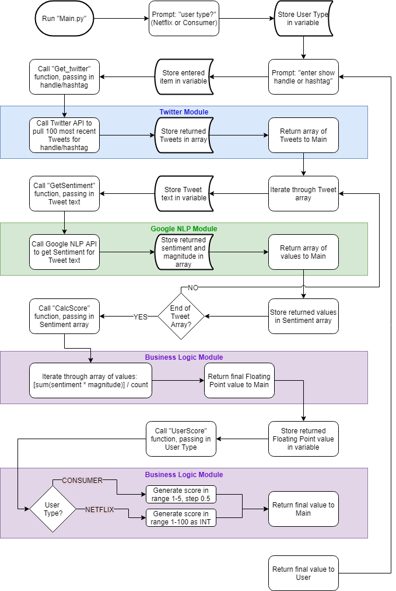

# EC601-MiniProject1

Team 3 - Matthew Boyd, Chenhui "Elvis" Zhu

#### Contents

* [Product Mission](#product-mission)
* [User Stores](#user-stories)
* [Architecture Needed](#architecture-needed)
* [Run Program](#run-program)
* [Code Flowchart](#code-flowchart)

<a name="product-mission"/>

## Product Mission

Provide Netflix show creators/producers, and the watching public, Tweet sentiment about current Netflix original content.
* Version 1 of our product will only include information about a select list of shows and seasons.
* Version 1 will also prompt for user type on initial execution; final product would have separate entry points for the 2 types of users.

<a name="user-stories"/>

## User Stories

1. I, as Netflix, would like to know recent ("current") public sentiment about an original show based on Tweet sentiment in a range from 1-100 as an average of 100 mixed (recent and popular) Tweets.

2. I, as a Netflix watcher, would like to know current public rating for an original Netflix show based on Tweet sentiment in a range from 1 star (bad) to 5 stars (really good) as an average of 100 mixed (recent and popular) Tweets.

<a name="architecture-needed"/>

## Architecture Needed

* Python code running on computer with Internet access.

* At this time no persistent local (file) or external (servers, databases, etc.) resources will be used.

<a name="run-program"/>

## Run Program

*Assumes __Google Natural Language API__, __Tweepy__, and __NLTK__ packages already installed.*

*Assumes __Twitter API Security Keys__ available and __Google NLAPI JSON file__ available.*

*Requires __Python 3.x__ to run!*

1. Copy code locally
2. Ensure the following Python packages are installed: Google Natural Language API, Tweepy, NLTK
3. Add Twitter API credentials to local "config.py" file and save:
   ```python
   consumer_key = "[key]"
   consumer_secret = "[key]"
   access_token = "[key]"
   access_token_secret = "[key]"
   ```
4. Open terminal/command window and navigate to folder where code was downloaded
5. Run platform-specific command to point program to Google NLAPI JSON file
6. Run "python Main.py"
7. Enter "user type" as prompted (cannot change this without restarting program)
8. Enter show "@" handle or "#" hashtag
9. Exit using "Ctrl-C" (or equivalent code-interruption key combination for your platform)

<a name="code-flowchart"/>

## Code Flowchart


