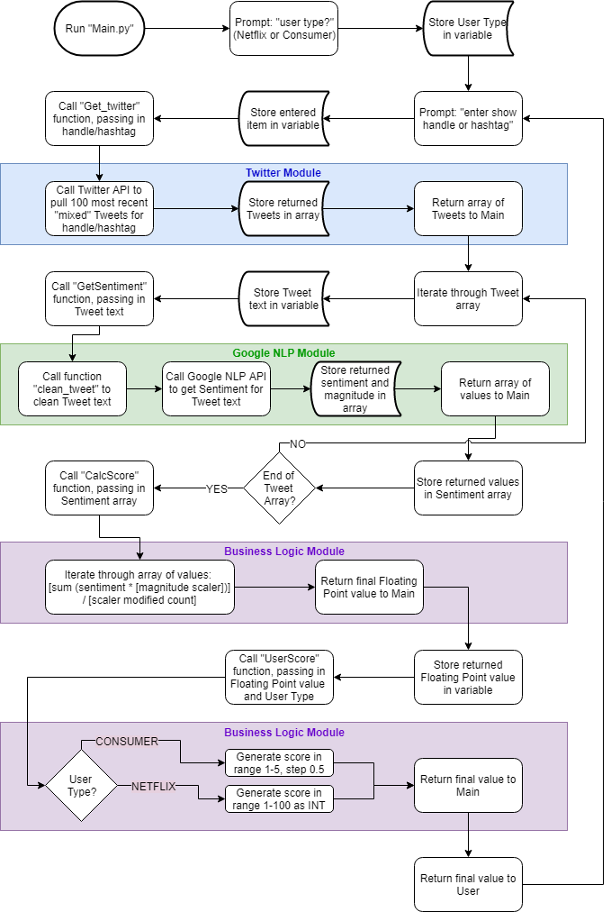

# EC601-MiniProject1

Team 3 - Matthew Boyd, Chenhui "Elvis" Zhu

#### Contents

* [Product Mission](#product-mission)
* [User Stores](#user-stories)
* [Architecture Needed](#architecture-needed)
* [Run Program](#run-program)
* [Code Flowchart](#code-flowchart)
* [Test Cases](#test-cases)
* [Lessons Learned](#lessons-learned)

<a name="product-mission"/>

## Product Mission

Provide Netflix show creators/producers, and the watching public, Tweet sentiment about current Netflix original content.
* Version 1 of our product will only include information about a select list of shows and seasons.
* Version 1 will also prompt for user type on initial execution; final product would have separate entry points for the 2 types of users.

<a name="user-stories"/>

## User Stories

1. I, as Netflix, would like to know recent ("current") public sentiment about an original show based on Tweet sentiment in a range from 1-100 as an average of 100 mixed (recent and popular) Tweets.

2. I, as a Netflix watcher, would like to know current public rating for an original Netflix show based on Tweet sentiment in a range from 1 star (bad) to 5 stars (really good) as an average of 100 mixed (recent and popular) Tweets.

<a name="architecture-needed"/>

## Architecture Needed

* Python code running on computer with Internet access.

* At this time no persistent local (file) or external (servers, databases, etc.) resources will be used.

<a name="run-program"/>

## Run Program

*Assumes __Google Natural Language API__, __Tweepy__, and __NLTK__ packages already installed.*

*Assumes __Twitter API Security Keys__ available and __Google NLAPI JSON file__ available.*

*Requires __Python 3.x__ to run!*

1. Copy code locally
2. Ensure the following Python packages are installed: Google Natural Language API, Tweepy, NLTK
3. Add Twitter API credentials to local "config.py" file and save:
   ```python
   consumer_key = "[key]"
   consumer_secret = "[key]"
   access_token = "[key]"
   access_token_secret = "[key]"
   ```
4. Open terminal/command window and navigate to folder where code was downloaded
5. Run platform-specific command to point program to Google NLAPI JSON file
6. Run "python Main.py"
7. Enter "user type" as prompted (cannot change this without restarting program)
8. Enter show "@" handle or "#" hashtag
9. Exit using "Ctrl-C" (or equivalent code-interruption key combination for your platform)

<a name="code-flowchart"/>

## Code Flowchart



<a name="test-cases"/>

## Test Cases

1.	For Netflix watcher:
I, as a Netflix watcher, want to know whether the Netflix new show called Stranger Things is worth watching. I would like to use the product to know the current public rating for the show based on the Tweet sentiment in a range from 1 star to 5 stars.

  
<br /><br />  

2.	For Netflix:
I, as Netflix, want to see the public rating for the latest show called Top Boy based on the Tweet sentiment in range of 1-100. This rating system helps me get public feedback faster and more efficiently.

  
 

<a name="lessons-learned"/>

## Lessons Learned

__Chenhui "Elvis" Zhu:__
In this mini project, I worked with my teammate Matthew who is really a good and helpful guy and I learnt how to use twitter API and google API to get tweets and analyze the sentiment of the messages. I was response for the twitter API and I also designed the calculation and rating system for the product. Our product performs very well in the test and can output proper grades for different kinds of users. We could have done this project better and faster. During the project, we changed our project’s MVP for many times, which was caused by the insufficiently background research. This experience helps me realize the significance of previous research. For the future project, I should spend more time on the background information research which can determine the outline of the project

__Matthew Boyd:__
This project was interesting. As Elvis indicated, we changed our user stories a few times as we got to know more about the Twitter API and its limitations. I enjoyed learning more about the Google API (my primary focus) and about generating a text-based progress bar in Python.

Again, as Elvis indicated we should have done more research into the limitations of the Twitter API before attempting user stories. That would be the main change for next time.

My main takeaway from this project is that the Google Natural Language API is better suited to analyzing larger blocks of text than Tweets. Tweets are too messy, noisy, and short to provide a great deal of sentiment insight. In the future I would avoid attempting to analyze sentiment in this way - I would either choose a different product (than Twitter) or a different way of analyzing the content if forced to use Twitter.
